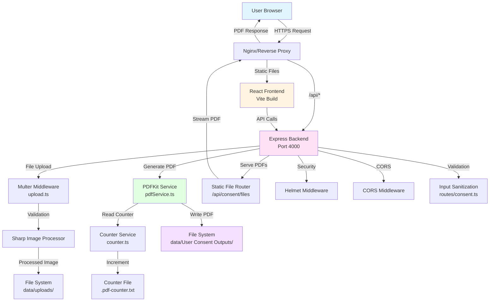
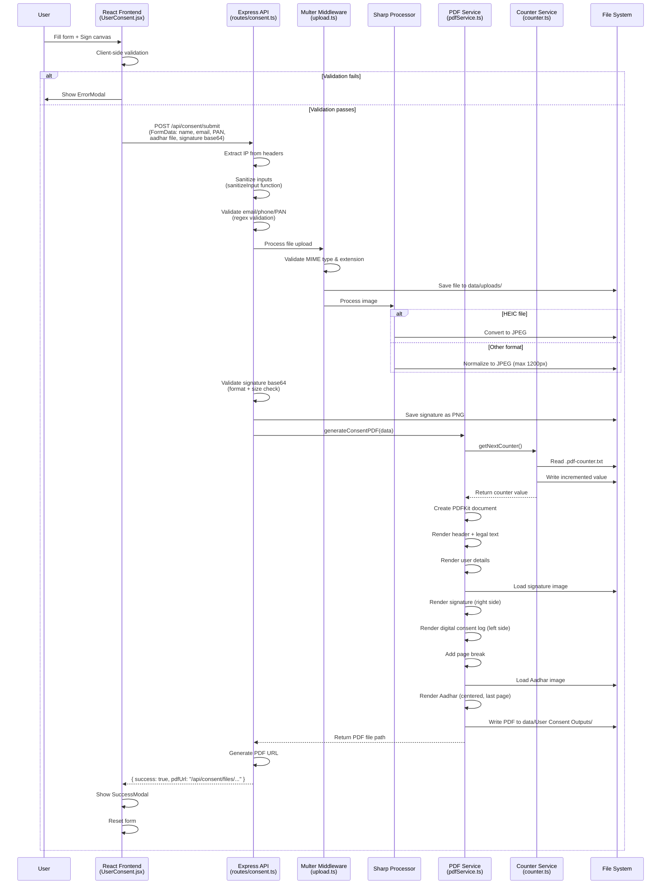
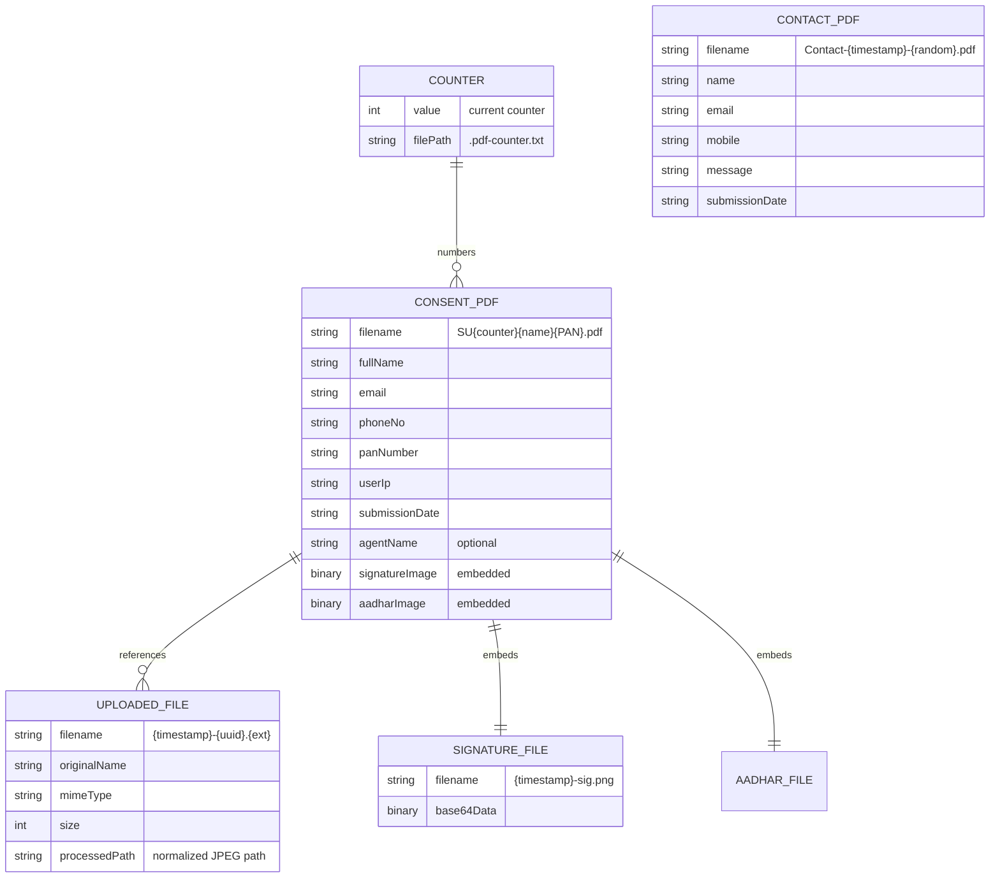

# Technical Architecture & System Logic Documentation
## Modern Trade - User Consent & Contact Management System

**Document Version:** 1.0  
**Last Updated:** January 2025  
**Prepared For:** External Engineering Team Handover

---

## 1. Executive Technical Summary

### Core Tech Stack

**Frontend:**
- **Language:** JavaScript (ES6+)
- **Framework:** React 18.3.1
- **Routing:** React Router DOM 6.26.0
- **Build Tool:** Vite 5.4.8
- **Styling:** Tailwind CSS 3.4.14
- **HTTP Client:** Axios 1.7.7
- **Signature Capture:** react-signature-canvas 1.0.6

**Backend:**
- **Language:** TypeScript 5.6.3
- **Runtime:** Node.js 20.x
- **Framework:** Express.js 4.21.0
- **File Upload:** Multer 1.4.5-lts.1
- **Image Processing:** Sharp 0.33.5
- **PDF Generation:** PDFKit 0.15.0
- **Security:** Helmet 7.1.0, CORS 2.8.5
- **UUID Generation:** uuid 10.0.0

### Infrastructure

- **Hosting:** File-based storage (no database)
- **Storage:** Local filesystem (`backend/data/`)
- **File Storage Locations:**
  - Uploads: `backend/data/uploads/`
  - Contact PDFs: `backend/data/Contact Us Outputs/`
  - Consent PDFs: `backend/data/User Consent Outputs/`
  - Counter: `backend/data/.pdf-counter.txt`
- **External Services:** None (self-contained)
- **Deployment:** VPS-ready, Docker-compatible, Railway/Render compatible

### Project Goal (Technical Perspective)

A **stateless, file-based web application** that:
1. Captures user consent forms with PII (PAN, Aadhar, signature)
2. Validates and sanitizes all user inputs server-side
3. Generates legally-formatted PDF documents with embedded images
4. Serves generated PDFs via static file endpoints
5. Tracks submissions using an incrementing counter system
6. Logs user IP addresses for legal compliance

**Key Design Decision:** No database - all data persistence is file-based for simplicity and legal document retention.

---

## 2. System Architecture Diagram



---

## 3. Directory & File Structure

### Root Structure

```
modern-trade-monorepo/
├── backend/                    # Express.js TypeScript Backend
│   ├── src/
│   │   ├── index.ts           # Application entry point, middleware setup
│   │   ├── routes/
│   │   │   ├── consent.ts     # User consent form endpoint handler
│   │   │   └── contact.ts     # Contact form endpoint handler
│   │   ├── services/
│   │   │   ├── pdfService.ts  # PDF generation logic (CRITICAL)
│   │   │   ├── storage.ts     # Directory management utilities
│   │   │   └── counter.ts     # Sequential counter for PDF naming
│   │   └── middlewares/
│   │       └── upload.ts      # Multer file upload configuration
│   ├── data/                   # Runtime data storage (gitignored)
│   │   ├── uploads/           # Temporary uploaded files
│   │   ├── Contact Us Outputs/ # Generated contact PDFs
│   │   ├── User Consent Outputs/ # Generated consent PDFs
│   │   └── .pdf-counter.txt   # Sequential counter state
│   ├── dist/                   # Compiled JavaScript (TypeScript output)
│   └── package.json
│
├── frontend/                   # React SPA Frontend
│   ├── src/
│   │   ├── main.jsx           # React DOM root initialization
│   │   ├── App.jsx            # Router configuration, layout wrapper
│   │   ├── pages/
│   │   │   ├── Home.jsx       # Landing page
│   │   │   ├── ContactUs.jsx   # Contact form page (CRITICAL)
│   │   │   ├── UserConsent.jsx # Consent form page (CRITICAL)
│   │   │   └── TermsAndConditions.jsx
│   │   ├── components/
│   │   │   ├── PhoneInput.jsx # International phone input component
│   │   │   ├── ErrorModal.jsx # Custom error popup (replaces browser alerts)
│   │   │   ├── SuccessModal.jsx # Success confirmation modal
│   │   │   └── [Other UI components]
│   │   ├── config/
│   │   │   └── brand.js       # Centralized brand configuration
│   │   └── utils/
│   │       └── imageUtils.js  # Image path utilities
│   ├── public/
│   │   └── images/            # Static image assets
│   └── dist/                   # Production build output
│
└── TermsAgreement.html          # Legal text template (unused in current implementation)
```

### Core Files Explained

**Backend Core Files:**

1. **`backend/src/index.ts`** (59 lines)
   - **Responsibility:** Application bootstrap, middleware chain setup
   - **Key Logic:**
     - Configures Helmet security headers
     - Sets up CORS with origin whitelist from `ALLOWED_ORIGINS` env var
     - Configures body parser with 5MB limit
     - Mounts route handlers at `/api/consent` and `/api/contact`
     - Enables `trust proxy` for accurate IP extraction
     - Initializes directory structure via `ensureDirs()`

2. **`backend/src/routes/consent.ts`** (184 lines)
   - **Responsibility:** User consent form submission handler
   - **Key Logic:**
     - Validates required fields (fullName, email, phoneNo, panNumber, aadhar file, signature)
     - Sanitizes inputs via `sanitizeInput()` function (removes `<>`, trims, length limits)
     - Validates email with regex: `/^[^\s@]+@[^\s@]+\.[^\s@]+$/`
     - Validates phone with regex: `/^\+?[1-9]\d{1,14}$/`
     - Validates PAN with regex: `/^[A-Z]{5}[0-9]{4}[A-Z]{1}$/`
     - Extracts user IP from headers (`x-forwarded-for`, `x-real-ip`, `req.ip`)
     - Processes Aadhar image with Sharp (converts HEIC, normalizes to JPEG)
     - Validates signature base64 format and size (max 500KB)
     - Calls `generateConsentPDF()` with all validated data
     - Serves generated PDFs via static file router at `/api/consent/files/`

3. **`backend/src/routes/contact.ts`** (98 lines)
   - **Responsibility:** Contact form submission handler
   - **Key Logic:**
     - Similar validation to consent route (name, email, phone, message)
     - Calls `generateContactPDF()` for simpler PDF generation
     - Serves PDFs at `/api/contact/files/`

4. **`backend/src/services/pdfService.ts`** (303 lines) - **CRITICAL FILE**
   - **Responsibility:** PDF document generation engine
   - **Key Functions:**
     - `generateContactPDF()`: Creates simple contact form PDF
     - `generateConsentPDF()`: Creates complex legal consent PDF
   - **PDF Generation Logic:**
     - Uses PDFKit library to create A4 documents
     - **Consent PDF Structure:**
       1. Header: Company name and tagline (centered)
       2. Legal text: Hardcoded 6-section agreement (formatted with Helvetica fonts)
       3. Execution section: User details (name, email, phone, PAN)
       4. Signature: Positioned on right side (x: 345pt), max 200x80pt
       5. Digital Consent Log: Left side, includes IP address and date
       6. Page break (forced)
       7. Annexure A: Aadhar card image on last page (centered, max 450x600pt)
     - **Counter Integration:** Calls `getNextCounter()` to get sequential number
     - **Filename Format:** `SU{counter}{sanitizedName}{PAN}.pdf`
     - **Image Handling:** Supports both file paths and base64 strings
     - **Page Management:** Automatic page breaks when content exceeds 750pt height

5. **`backend/src/services/counter.ts`** (40 lines)
   - **Responsibility:** Sequential counter management for PDF naming
   - **Key Logic:**
     - Reads counter from `data/.pdf-counter.txt`
     - Increments and writes back atomically
     - Starts at 1 if file doesn't exist
     - Returns current counter (before increment) for filename

6. **`backend/src/services/storage.ts`** (20 lines)
   - **Responsibility:** Directory creation and path management
   - **Key Functions:**
     - `ensureDirs()`: Creates upload and PDF directories
     - `ensureContactOutputDir()`: Creates contact PDF directory
     - `ensureConsentOutputDir()`: Creates consent PDF directory
   - **Path Resolution:** Uses environment variables with fallback to relative paths

7. **`backend/src/middlewares/upload.ts`** (54 lines)
   - **Responsibility:** File upload security and validation
   - **Key Logic:**
     - **Allowed MIME Types:** `image/jpeg`, `image/jpg`, `image/png`, `image/heic`, `application/pdf`
     - **Allowed Extensions:** `.jpg`, `.jpeg`, `.png`, `.heic`, `.pdf`
     - **File Size Limit:** 8MB maximum
     - **Filename Sanitization:** Removes special characters, replaces with `_`
     - **Filename Format:** `{timestamp}-{uuid}.{ext}`
     - **Dual Validation:** Checks both file extension AND MIME type

**Frontend Core Files:**

1. **`frontend/src/main.jsx`** (6 lines)
   - **Responsibility:** React application entry point
   - **Key Logic:** Uses React 18's `createRoot()` API to mount `<App />` component

2. **`frontend/src/App.jsx`** (28 lines)
   - **Responsibility:** Application routing and layout structure
   - **Routes:**
     - `/` → `<Home />`
     - `/lets-talk` → `<ContactUs />`
     - `/user-consent` → `<UserConsent />`
     - `/terms-and-conditions` → `<TermsAndConditions />`

3. **`frontend/src/pages/UserConsent.jsx`** (467 lines) - **CRITICAL FILE**
   - **Responsibility:** User consent form UI and validation
   - **Key Logic:**
     - **State Management:** Uses React hooks (`useState`, `useRef`, `useEffect`)
     - **Form Fields:** fullName, email, phoneNo, panNumber, agentName, acceptTerms, file, signature
     - **Client-Side Validation:**
       - Name: minimum 2 characters
       - Email: regex validation `/^[^\s@]+@[^\s@]+\.[^\s@]+$/`
       - Phone: minimum 4 characters after country code
       - PAN: exactly 10 characters
       - File: required, max 8MB
       - Signature: must not be empty (checked via `sigRef.current.isEmpty()`)
       - Terms: checkbox must be checked
     - **Signature Canvas:**
       - Uses `react-signature-canvas` library
       - Dynamic canvas sizing to prevent coordinate offset issues
       - Canvas resizes to match container dimensions (handles responsive design)
       - Exports signature as base64 PNG: `getTrimmedCanvas().toDataURL('image/png')`
     - **Form Submission:**
       - Creates `FormData` object
       - Sends multipart/form-data to `/api/consent/submit`
       - Shows `ErrorModal` for validation failures (replaces browser alerts)
       - Shows `SuccessModal` on success
     - **Error Handling:** Catches axios errors, displays user-friendly messages

4. **`frontend/src/pages/ContactUs.jsx`** (267 lines)
   - **Responsibility:** Contact form UI and validation
   - **Key Logic:** Similar validation pattern to UserConsent, simpler form (no file upload)

5. **`frontend/src/components/PhoneInput.jsx`** (61 lines)
   - **Responsibility:** International phone number input with country selector
   - **Key Logic:**
     - Supports 10 countries with dial codes
     - Validates input to numeric only
     - Enforces country-specific max length
     - Formats output as `{dialCode}{number}` (e.g., `+919191291912`)

6. **`frontend/src/components/ErrorModal.jsx`** (39 lines)
   - **Responsibility:** Custom error popup (replaces browser `alert()`)
   - **Key Logic:** Modal overlay with red theme, displays error message, matches site design

---

## 4. Key Feature Logic & Data Flows

### 4.1 Authentication & User Verification

**Status:** No authentication system implemented.

The application is **public-facing** with no user accounts, sessions, or JWT tokens. All forms are accessible without login. This is by design for a consent collection system.

### 4.2 User Input Handling & PII Processing

**Flow Location:** `backend/src/routes/consent.ts` (lines 32-159)

**Step-by-Step PII Processing:**

1. **Request Reception** (line 32)
   - Endpoint: `POST /api/consent/submit`
   - Receives `multipart/form-data` with fields: `fullName`, `email`, `phoneNo`, `panNumber`, `agentName`, `aadhar` (file), `signature` (base64)

2. **Field Validation** (lines 38-47)
   - Checks required fields exist
   - Validates file presence
   - Validates signature presence

3. **IP Address Extraction** (lines 49-80)
   - Priority order:
     1. `x-forwarded-for` header (first IP in comma-separated list)
     2. `x-real-ip` header
     3. `req.ip` (from Express)
     4. `req.socket.remoteAddress` or `req.connection.remoteAddress`
   - IPv6 to IPv4 conversion: `::1` → `127.0.0.1`
   - IPv6 prefix removal: `::ffff:192.168.1.1` → `192.168.1.1`

4. **Input Sanitization** (lines 89-94)
   - **Function:** `sanitizeInput(input: string, maxLength: number)`
   - **Location:** `backend/src/routes/consent.ts` (lines 11-14)
   - **Process:**
     - Trims whitespace
     - Slices to max length
     - Removes `<` and `>` characters (XSS prevention)
   - **Applied to:**
     - fullName: max 100 chars
     - email: max 255 chars
     - phoneNo: max 20 chars
     - panNumber: max 10 chars, uppercase, alphanumeric only

5. **Validation Functions** (lines 16-30)
   - **Email:** `/^[^\s@]+@[^\s@]+\.[^\s@]+$/`
   - **Phone:** `/^\+?[1-9]\d{1,14}$/` (E.164 format)
   - **PAN:** `/^[A-Z]{5}[0-9]{4}[A-Z]{1}$/` (exactly 10 chars, format: ABCDE1234F)

6. **File Processing** (lines 118-129)
   - **Location:** `backend/src/middlewares/upload.ts`
   - **Process:**
     - File saved to `data/uploads/` with UUID filename
     - If HEIC: Converted to JPEG via Sharp
     - If other: Normalized to JPEG, resized to max 1200px width
     - Processed file path stored for PDF generation

7. **Signature Processing** (lines 131-145)
   - **Validation:**
     - Regex: `/^data:(image\/(png|jpeg));base64,(.+)$/`
     - Size limit: 500KB base64 string
   - **Storage:**
     - Decoded from base64 to Buffer
     - Saved as PNG to `data/uploads/{timestamp}-sig.png`

8. **PDF Generation Call** (lines 147-159)
   - Passes all sanitized data to `generateConsentPDF()`
   - Returns PDF file path
   - Response includes PDF URL for download

### 4.3 PDF Generation Module

**Flow Location:** `backend/src/services/pdfService.ts`

**Function:** `generateConsentPDF(opts)` (lines 60-302)

**PDF Generation Process:**

1. **Counter Retrieval** (line 78)
   - Calls `getNextCounter()` from `counter.ts`
   - Reads current value from `data/.pdf-counter.txt`
   - Increments and saves back
   - Used in filename: `SU{counter}{name}{PAN}.pdf`

2. **PDF Document Initialization** (lines 88-100)
   - Creates PDFKit document: A4 size, 50pt margins
   - Sets metadata (Title, Author, Subject, Creator)
   - Creates write stream to file path

3. **Header Section** (lines 102-105)
   - Company name: "MODERN TRADE" (18pt, bold, centered)
   - Tagline: "Your Premium Market Analysis Service in India" (12pt, centered)

4. **Legal Text Section** (lines 107-163)
   - **Hardcoded Legal Text Array** (lines 116-140):
     - 6 sections with structured formatting
     - Each item has: `text`, `size`, `bold`, `spacing` properties
   - **Rendering Logic:**
     - Loops through legal text array
     - Checks page height (750pt max, 50pt bottom margin)
     - Adds page break if needed
     - Uses Helvetica-Bold for headings (12pt), Helvetica for body (10pt)
     - Justified alignment for body text, left for headings
   - **Dynamic Content:** User name inserted into section 1 text

5. **Execution Section** (lines 167-192)
   - User details table:
     - Full Name
     - Email
     - Phone Number
     - PAN Card Number
     - Agent Name (optional)

6. **Signature Section** (lines 196-241)
   - **Positioning:**
     - Right side of page: `x = 595pt - 50pt - 200pt = 345pt`
     - Width: 200pt, Height: 80pt
   - **Image Loading:**
     - Tries base64 string first (`opts.signatureImage`)
     - Falls back to file path (`opts.signaturePath`)
     - Decodes base64 if needed
   - **Rendering:** Places image at calculated x,y coordinates

7. **Digital Consent Log** (lines 243-252)
   - Left side of page (same Y as signature)
   - Contains:
     - Signed by: {fullName}
     - IP Address: {userIp}
     - Date: {submissionDate}

8. **Page Break** (line 255)
   - Forces new page: `doc.addPage()`

9. **Aadhar Card Annexure** (lines 257-295)
   - **Caption:** "Annexure A: User Identity Document (Aadhar)" (centered)
   - **Image Loading:**
     - Tries base64 first, then file path
   - **Positioning:**
     - Centered: `x = (595pt - 450pt) / 2 = 72.5pt`
     - Max dimensions: 450pt width, 600pt height
   - **Scaling:** Maintains aspect ratio, fits within bounds

10. **File Finalization** (lines 297-301)
    - Closes PDF stream: `doc.end()`
    - Waits for stream `finish` event
    - Returns file path

**Contact PDF Generation:**

**Function:** `generateContactPDF(opts)` (lines 7-58)

Simpler version:
- No counter (uses timestamp + random ID)
- Filename: `Contact-{timestamp}-{random}.pdf`
- Contains: Header, submission date, reference ID, contact info, message

### 4.4 Consent/Legal Logic Capture

**Consent Capture Flow:**

1. **Frontend Display** (`frontend/src/pages/UserConsent.jsx`)
   - Legal text displayed in UI (lines 274-286)
   - User must scroll through and read
   - Checkbox: "I accept Terms and Conditions" (line 424-435)
   - Signature required via canvas (lines 384-421)

2. **Client-Side Validation** (lines 112-171)
   - Validates all fields including checkbox
   - Validates signature is not empty
   - Shows `ErrorModal` if validation fails

3. **Submission** (lines 173-216)
   - Creates FormData with all fields
   - Signature exported as base64 PNG
   - Sent to backend via POST

4. **Backend Processing** (`backend/src/routes/consent.ts`)
   - Validates checkbox was checked (implicitly via form submission)
   - Validates signature exists
   - Generates PDF with all consent data

5. **PDF Storage**
   - PDF saved to `data/User Consent Outputs/`
   - Filename includes counter, name, PAN for traceability
   - PDF contains:
     - Legal text (hardcoded in `pdfService.ts`)
     - User details
     - Signature image
     - IP address
     - Date
     - Aadhar card image

**Consent Storage:** PDF files serve as the legal record. No database storage - files are the source of truth.

### 4.5 Data Flow Sequence Diagram



---

## 5. Database Schema & Data Models

### 5.1 Storage Architecture

**Important:** This system uses **file-based storage only**. There is **no database** (no MongoDB, PostgreSQL, MySQL, etc.).

### 5.2 Data Persistence Model

**File-Based Entities:**

1. **User Consent Records**
   - **Storage:** PDF files in `backend/data/User Consent Outputs/`
   - **Filename Format:** `SU{counter}{sanitizedName}{PAN}.pdf`
   - **Example:** `SU5JohnDoeABCDE1234F.pdf`
   - **Content:** Complete legal document with embedded images

2. **Contact Form Records**
   - **Storage:** PDF files in `backend/data/Contact Us Outputs/`
   - **Filename Format:** `Contact-{timestamp}-{random}.pdf`
   - **Example:** `Contact-1765701398218-27d3l5c0o9j.pdf`
   - **Content:** Contact information and message

3. **Uploaded Files**
   - **Storage:** `backend/data/uploads/`
   - **Filename Format:** `{timestamp}-{uuid}.{ext}`
   - **Types:** Aadhar images, signature images
   - **Processing:** HEIC converted to JPEG, others normalized

4. **Counter State**
   - **Storage:** `backend/data/.pdf-counter.txt`
   - **Format:** Single integer (e.g., `5`)
   - **Purpose:** Sequential numbering for consent PDFs
   - **Management:** Read-increment-write pattern in `counter.ts`

### 5.3 Data Model Diagram



### 5.4 Data Flow Relationships

- **One Consent Submission** → **One PDF File** (1:1)
- **One Consent Submission** → **One Aadhar Upload** (1:1)
- **One Consent Submission** → **One Signature** (1:1)
- **Counter** → **Multiple PDFs** (1:N, sequential)

---

## 6. Security & Compliance Measures

### 6.1 Input Sanitization (XSS Prevention)

**Implementation Location:** `backend/src/routes/consent.ts` and `backend/src/routes/contact.ts`

**Sanitization Function:**
```typescript
function sanitizeInput(input: string, maxLength: number = 1000): string {
  if (!input || typeof input !== 'string') return '';
  return input.trim().slice(0, maxLength).replace(/[<>]/g, '');
}
```

**Applied To:**
- All text inputs (name, email, phone, PAN, message)
- Removes `<` and `>` characters (prevents HTML/script injection)
- Trims whitespace
- Enforces maximum length per field

**PAN Number Special Handling:**
- Uppercase conversion: `.toUpperCase()`
- Alphanumeric only: `.replace(/[^A-Z0-9]/g, '')`
- Exact length: 10 characters

### 6.2 File Upload Security

**Implementation Location:** `backend/src/middlewares/upload.ts`

**Security Measures:**

1. **MIME Type Validation** (lines 6-12)
   - Whitelist: `image/jpeg`, `image/jpg`, `image/png`, `image/heic`, `application/pdf`
   - Rejects all other MIME types

2. **File Extension Validation** (line 14)
   - Whitelist: `.jpg`, `.jpeg`, `.png`, `.heic`, `.pdf`
   - Dual check: Both extension AND MIME type must match

3. **File Size Limit** (line 49)
   - Maximum: 8MB (`8 * 1024 * 1024` bytes)
   - Enforced by Multer

4. **Filename Sanitization** (line 22)
   - Removes special characters: `.replace(/[^a-zA-Z0-9.-]/g, '_')`
   - Prevents path traversal attacks

5. **Unique Filenames** (line 28)
   - Format: `{timestamp}-{uuid}.{ext}`
   - Prevents filename collisions and overwrites

6. **Signature Size Limit** (`consent.ts` line 139)
   - Maximum base64 size: 500KB
   - Prevents DoS via large signature data

### 6.3 Secrets & Credentials Management

**Implementation:** Environment variables via `process.env`

**Environment Variables Used:**

**Backend:**
- `PORT` - Server port (default: 4000)
- `NODE_ENV` - Environment mode (development/production)
- `ALLOWED_ORIGINS` - CORS whitelist (comma-separated)
- `UPLOAD_DIR` - Upload directory path
- `CONTACT_OUTPUT_DIR` - Contact PDF output directory
- `CONSENT_OUTPUT_DIR` - Consent PDF output directory
- `PDF_DIR` - Legacy PDF directory (unused)

**Frontend:**
- `VITE_API_BASE` - Backend API base URL (build-time variable)

**Storage:**
- `.env` file is gitignored (see `.gitignore`)
- No hardcoded secrets found in codebase
- All sensitive paths use environment variables with fallbacks

### 6.4 Sensitive File Storage & Serving

**PDF Storage:**
- **Location:** `backend/data/User Consent Outputs/` and `backend/data/Contact Us Outputs/`
- **Access Control:** Served via Express static file router
- **Headers:** Content-Type set to `application/pdf`, Content-Disposition: `inline`
- **Security:** Only PDF files are served (extension check in `setHeaders`)

**Uploaded Files:**
- **Location:** `backend/data/uploads/`
- **Access:** Not directly served to users
- **Processing:** Files are processed (normalized) and paths passed to PDF generation
- **Retention:** Original uploads remain in uploads directory

**Counter File:**
- **Location:** `backend/data/.pdf-counter.txt`
- **Access:** Read/write by counter service only
- **Format:** Plain text integer
- **Security:** Not served to clients

### 6.5 Additional Security Measures

1. **Helmet.js** (`backend/src/index.ts` lines 16-26)
   - Content Security Policy (CSP)
   - XSS protection headers
   - Frame options

2. **CORS** (`backend/src/index.ts` lines 28-44)
   - Origin whitelist from `ALLOWED_ORIGINS`
   - Credentials enabled
   - Rejects unauthorized origins

3. **Body Parser Limits** (line 47-48)
   - JSON: 5MB limit
   - URL-encoded: 5MB limit
   - Prevents DoS via large payloads

4. **Trust Proxy** (line 13)
   - Enables accurate IP extraction behind proxies
   - Required for production deployments

5. **Error Message Sanitization** (`consent.ts` line 165, `contact.ts` line 78)
   - Generic error messages: "Internal server error"
   - Prevents information leakage about internal structure

---

## 7. API Reference (Internal)

### 7.1 Consent Endpoints

**Base Path:** `/api/consent`

#### POST `/api/consent/submit`

**Purpose:** Submit user consent form with PII and generate legal PDF

**Request:**
- **Method:** POST
- **Content-Type:** `multipart/form-data`
- **Body Fields:**
  - `fullName` (string, required): User's full name
  - `email` (string, required): Valid email address
  - `phoneNo` (string, required): Phone number with country code
  - `panNumber` (string, required): 10-character PAN card number
  - `agentName` (string, optional): Agent/referrer name
  - `aadhar` (file, required): Aadhar card image (max 8MB)
  - `signature` (string, required): Base64-encoded signature image

**Validation:**
- Email: `/^[^\s@]+@[^\s@]+\.[^\s@]+$/`
- Phone: `/^\+?[1-9]\d{1,14}$/`
- PAN: `/^[A-Z]{5}[0-9]{4}[A-Z]{1}$/`
- File: MIME type and extension whitelist
- Signature: Base64 format, max 500KB

**Response:**
```json
{
  "success": true,
  "pdfUrl": "/api/consent/files/SU5JohnDoeABCDE1234F.pdf"
}
```

**Error Responses:**
- `400`: Missing required fields, invalid format, validation failure
- `500`: Internal server error (generic message)

**Implementation:** `backend/src/routes/consent.ts` (lines 32-168)

#### GET `/api/consent/files/:filename`

**Purpose:** Serve generated consent PDF files

**Request:**
- **Method:** GET
- **Path Parameter:** `filename` - PDF filename

**Response:**
- **Content-Type:** `application/pdf`
- **Content-Disposition:** `inline`
- **Body:** PDF file binary stream

**Security:** Only serves files from `CONSENT_OUTPUT_DIR`, validates `.pdf` extension

**Implementation:** `backend/src/routes/consent.ts` (lines 171-182)

### 7.2 Contact Endpoints

**Base Path:** `/api/contact`

#### POST `/api/contact/submit`

**Purpose:** Submit contact form and generate PDF

**Request:**
- **Method:** POST
- **Content-Type:** `application/json`
- **Body:**
```json
{
  "name": "John Doe",
  "mobile": "+919191291912",
  "email": "john@example.com",
  "message": "Contact message text"
}
```

**Validation:**
- Name: minimum 2 characters
- Email: `/^[^\s@]+@[^\s@]+\.[^\s@]+$/`
- Phone: `/^\+[1-9]\d{1,14}$/` (E.164 format)
- Message: minimum 10 characters

**Response:**
```json
{
  "success": true,
  "pdfUrl": "/api/contact/files/Contact-1765701398218-27d3l5c0o9j.pdf"
}
```

**Implementation:** `backend/src/routes/contact.ts` (lines 34-81)

#### GET `/api/contact/files/:filename`

**Purpose:** Serve generated contact PDF files

**Implementation:** `backend/src/routes/contact.ts` (lines 84-95)

### 7.3 Health Check Endpoint

#### GET `/health`

**Purpose:** Application health check

**Response:**
```json
{
  "status": "ok"
}
```

**Implementation:** `backend/src/index.ts` (line 54)

---

## 8. Additional Technical Details

### 8.1 Frontend Build Process

**Build Tool:** Vite 5.4.8

**Build Command:** `npm run build` (runs `vite build`)

**Output:**
- **Directory:** `frontend/dist/`
- **Files:**
  - `index.html` - Entry HTML
  - `assets/index-{hash}.js` - Bundled JavaScript
  - `assets/index-{hash}.css` - Bundled CSS
  - `images/` - Copied static assets

**Environment Variables:**
- `VITE_API_BASE` - Injected at build time
- Accessed via `import.meta.env.VITE_API_BASE`

### 8.2 Backend Build Process

**Build Tool:** TypeScript Compiler (tsc)

**Build Command:** `npm run build` (runs `tsc`)

**Output:**
- **Directory:** `backend/dist/`
- **Files:** Compiled JavaScript from TypeScript source
- **Structure:** Mirrors `src/` directory structure

**Runtime:**
- **Command:** `npm start` (runs `node dist/index.js`)
- **Development:** `npm run dev` (runs `ts-node-dev` with hot reload)

### 8.3 File Processing Pipeline

**Aadhar Image Processing:**

1. **Upload** → Multer saves to `data/uploads/{timestamp}-{uuid}.{ext}`
2. **Detection** → Check file extension
3. **HEIC Conversion** (if `.heic`):
   - Sharp converts to JPEG
   - Output: `{originalPath}.jpg`
4. **Normalization** (if other format):
   - Sharp resizes to max 1200px width
   - Converts to JPEG
   - Output: `{originalPath}-norm.jpg`
5. **PDF Integration** → Normalized path passed to PDF generator

**Signature Processing:**

1. **Frontend Export** → Canvas exports as base64 PNG
2. **Backend Validation** → Regex and size check
3. **Decoding** → Base64 → Buffer
4. **Storage** → Saved as `{timestamp}-sig.png`
5. **PDF Integration** → Both base64 and file path supported

### 8.4 Counter System Logic

**File:** `backend/src/services/counter.ts`

**Algorithm:**
1. Check if `data/.pdf-counter.txt` exists
2. If exists: Read integer value
3. If not: Start at 1
4. Increment value
5. Write incremented value back to file
6. Return original value (before increment)

**Race Condition Handling:** None - single-threaded Node.js, but not atomic. For production, consider file locking or database.

**Usage:** Called once per consent PDF generation to ensure unique sequential numbering.

---

## 9. Deployment Architecture

### 9.1 Production Build Structure

```
Production Deployment:
├── Frontend (Static Files)
│   └── Served by: Nginx / CDN / Static Host
│   └── Files: frontend/dist/*
│
└── Backend (Node.js Process)
    ├── Compiled: backend/dist/*
    ├── Runtime: Node.js 20.x
    ├── Process Manager: PM2 (recommended)
    └── Data: backend/data/* (persistent volume)
```

### 9.2 Environment Configuration

**Required Environment Variables:**

```bash
# Backend
PORT=4000
NODE_ENV=production
ALLOWED_ORIGINS=https://yourdomain.com,https://www.yourdomain.com
UPLOAD_DIR=./data/uploads
CONTACT_OUTPUT_DIR=./data/Contact Us Outputs
CONSENT_OUTPUT_DIR=./data/User Consent Outputs

# Frontend (build-time)
VITE_API_BASE=https://api.yourdomain.com/api
```

### 9.3 Reverse Proxy Configuration

**Nginx Example:** See `nginx.conf.example`

**Key Points:**
- Frontend served as static files
- `/api/*` proxied to Express backend (port 4000)
- IP forwarding headers configured for accurate IP extraction
- File upload size limit: 8MB

---

## 10. Critical Code Paths Summary

### 10.1 User Consent Submission Flow

**Entry Point:** `frontend/src/pages/UserConsent.jsx` → `onSubmit()` (line 112)

**Backend Entry:** `backend/src/routes/consent.ts` → `router.post('/submit')` (line 32)

**Critical Functions Called:**
1. `sanitizeInput()` - Input sanitization
2. `validateEmail()` - Email validation
3. `validatePhone()` - Phone validation
4. `validatePAN()` - PAN validation
5. `sharp()` - Image processing
6. `generateConsentPDF()` - PDF generation
7. `getNextCounter()` - Counter retrieval

**Output:** PDF file path returned to frontend

### 10.2 PDF Generation Flow

**Entry Point:** `backend/src/services/pdfService.ts` → `generateConsentPDF()` (line 60)

**Critical Steps:**
1. Counter retrieval
2. PDFKit document creation
3. Legal text rendering (hardcoded array)
4. User details rendering
5. Signature image embedding (right side positioning)
6. Digital consent log rendering (left side, includes IP)
7. Page break
8. Aadhar image embedding (last page, centered)
9. File write and stream completion

**Output:** PDF file written to filesystem

---

## 11. Known Limitations & Technical Debt

1. **No Database:** File-based storage may not scale for high-volume deployments
2. **Counter Race Conditions:** File-based counter not atomic (acceptable for single-instance)
3. **No Authentication:** Public-facing forms (by design)
4. **No Email Notifications:** PDFs generated but not emailed
5. **No Backup Strategy:** PDFs stored only on server filesystem
6. **Static Legal Text:** Hardcoded in `pdfService.ts` (not templated)
7. **IPv6 Handling:** Basic conversion, may need enhancement for complex proxy setups

---

## 12. Maintenance & Extension Points

### 12.1 Adding New Form Fields

**Location:** `frontend/src/pages/UserConsent.jsx` and `backend/src/routes/consent.ts`

**Steps:**
1. Add field to React state
2. Add input to form JSX
3. Add validation in `onSubmit()`
4. Add sanitization in backend route
5. Update PDF generation to include field

### 12.2 Modifying Legal Text

**Location:** `backend/src/services/pdfService.ts` (lines 116-140)

**Process:** Edit the `legalText` array, maintain structure: `{ text, size, bold, spacing }`

### 12.3 Changing PDF Layout

**Location:** `backend/src/services/pdfService.ts` → `generateConsentPDF()`

**Key Coordinates:**
- Page width: 595pt (A4)
- Margins: 50pt
- Signature position: x = 345pt (right side)
- Aadhar max size: 450x600pt

### 12.4 Adding Database

**Migration Path:**
1. Install database driver (MongoDB/PostgreSQL)
2. Create schema for consent records
3. Store metadata in database
4. Keep PDFs in filesystem (or move to object storage)
5. Update routes to save to database after PDF generation

---

**End of Technical Architecture Document**

